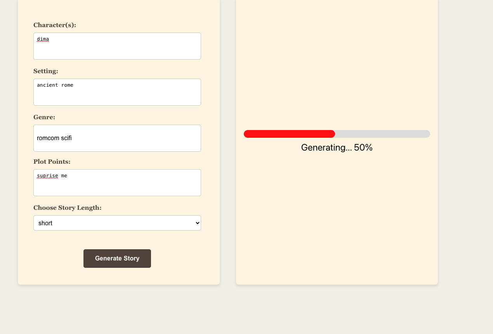

# AI Story Generator

## Overview

AI Story Generator is a creative tool that leverages OpenAI's GPT-3.5-turbo model to craft captivating stories. Users can define characters, settings, genres, and plot points, and then let the AI bring their vision to life with a story tailored to their preferences.


## Features

- **Customizable Story Elements**: Input your desired characters, settings, genres, and plot points to guide the story's direction.
- **Selectable Story Length**: Choose how long you want your story to be, ranging from under 3 paragraphs to 5-8 paragraphs.
- **Live Loading Screen**: As the AI generates your story, watch the progress on a dynamic loading bar.



- **Scrollable Display**: The generated story is presented in a scrollable container, accommodating stories of any length without overwhelming the screen.
- **Responsive Design**: Whether on desktop or mobile, the layout adjusts to provide an optimal viewing experience.


## How It Works

1. **Input Story Details**: Fill out the form with the elements of your story.
2. **Choose Length**: Select the desired length for your story.
3. **Generate**: Hit the 'Generate Story' button to send your prompt to the AI.
4. **View**: The generated story will appear on the right, styled appropriately based on the genre and with an indicative title.

## Installation

Before running the project, ensure you have `node` and `npm` installed on your system.

```bash
# Clone the repository
git clone https://github.com/your-username/ai-story-generator.git

# Navigate to the project directory
cd ai-story-generator

# Install dependencies
npm install

# Start the application
npm start
```

## Environment Variables
Make sure to set up your environment variables before starting the app:
REACT_APP_OPENAI=your_openai_api_key


## Usage
After starting the app, the interface will guide you through crafting your story. Once generated, you can interact with the story container:

1. **Scroll Indicator**: A subtle ↓ appears if the story overflows the container, guiding you to scroll for more content.
2. **Scrollable Content**: Use your mouse or touchpad to scroll through the story.